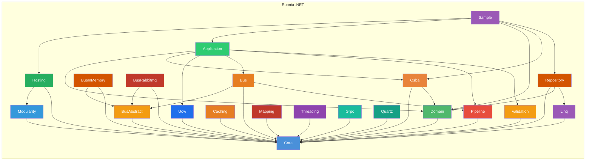
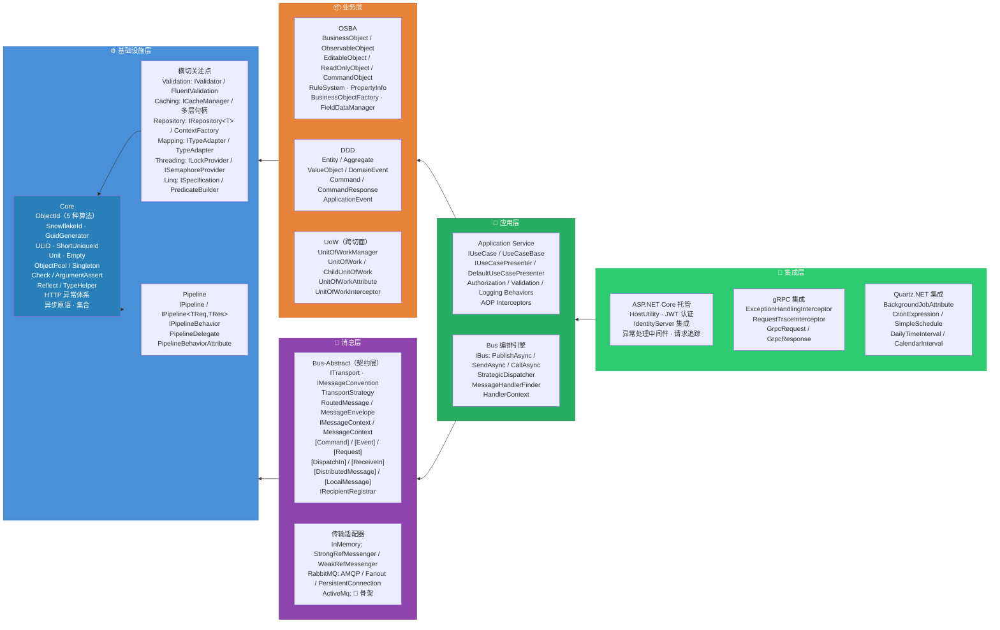

# Euonia .NET 框架

> *Eunoia* —— 源自希腊语 *εὔνοια*：美好的思维、善意、心态平和。

Euonia 是一个用于构建企业级 .NET 应用的开发框架。它将**面向对象可扩展业务架构（OSBA）**与**领域驱动设计（DDD）**理念结合起来，为构建健壮、可维护的业务系统提供完整基础设施。框架基于 **.NET 8+**，可与 **ASP.NET Core** 无缝集成。

- **语言**: C# (.NET 8+)
- **构建工具**: NuGet / MSBuild
- **许可证**: Apache License 2.0
- **仓库**: [euonia-project/euonia-net](https://github.com/euonia-project/euonia-net)
- **最新版本**: 2026.3.2
- **作者**: damon (zhaorong@outlook.com)

---

## 模块总览



## 模块列表

| 模块 | NuGet 包 | 文件数 | 层次 | 说明 | 文档 |
|------|---------|--------|------|------|------|
| **Core** | `Euonia.Core` | 144 | 基础层 | ID 生成、对象池、元组、参数校验、HTTP 异常、反射、DI 抽象、集合、线程原语 | [📖](./core/) |
| **Modularity** | `Euonia.Modularity` | 45 | 基础层 | 模块化系统：模块加载生命周期、自动 DI 注册、类型/程序集发现、方法拦截 | [📖](./modularity/) |
| **Domain** | `Euonia.Domain` | 18 | 业务层 | DDD 战术工具箱：Entity、Aggregate、ValueObject、DomainEvent、Command | [📖](./domain/) |
| **Osba** | `Euonia.Osba` | 35 | 业务层 | 面向对象业务架构：规则校验、属性追踪、状态机、反射工厂 | [📖](./osba/) |
| **Uow** | `Euonia.Uow` | 14 | 业务层 | 工作单元抽象：事务边界、提交/回滚、AsyncLocal 作用域、AOP 拦截器 | [📖](./uow/) |
| **Pipeline** | `Euonia.Pipeline` | 7 | 基础设施 | ASP.NET Core 风格中间件管道框架 | [📖](./pipeline/) |
| **Application** | `Euonia.Application` | 17 | 应用层 | 用例模式、管道行为（授权/校验/日志/UoW）、AOP 拦截器 | [📖](./application/) |
| **Validation** | `Euonia.Validation` | 16 | 基础设施 | 分层校验框架：对象校验器 + FluentValidation 集成 + 校验工厂 | [📖](./validation/) |
| **Bus.Abstract** | `Euonia.Bus.Abstract` | 62 | 消息层 | 消息总线抽象契约：传输、约定、策略、信封、属性、事件 | [📖](./bus-abstract/) |
| **Bus** | `Euonia.Bus` | 37 | 消息层 | 消息总线编排引擎：处理器发现、分发、序列化、管道集成 | [📖](./bus/) |
| **Bus.InMemory** | `Euonia.Bus.InMemory` | 33 | 消息层 | 进程内内存传输：双信使引擎（强引用/弱引用）、GC 友好 | [📖](./bus-inmemory/) |
| **Bus.RabbitMq** | `Euonia.Bus.RabbitMq` | 21 | 消息层 | RabbitMQ AMQP 传输：Fanout 多播、Direct 队列、RPC 调用、Polly 重试 | [📖](./bus-rabbitmq/) |
| **Hosting** | `Euonia.Hosting` | 17 | 集成层 | ASP.NET Core 托管：认证/授权中间件、JWT、异常处理、请求追踪 | [📖](./hosting/) |
| **Caching** | `Euonia.Caching` | 40 | 基础设施 | 多层缓存系统：缓存句柄链、滑动/绝对过期、背板同步 | [📖](./caching/) |
| **Repository** | `Euonia.Repository` | 15 | 基础设施 | 仓储模式抽象：Entity、IRepository、ContextFactory/Provider | [📖](./repository/) |
| **Mapping** | `Euonia.Mapping` | 5 | 基础设施 | 对象映射抽象门面：ITypeAdapter + TypeAdapterFactory | [📖](./mapping/) |
| **Threading** | `Euonia.Threading` | 8 | 基础设施 | 分布式锁抽象：ILockProvider、ISemaphoreProvider、ILockFactory | [📖](./threading/) |
| **Linq** | `Euonia.Linq` | 22 | 基础设施 | LINQ 工具包：规约模式、动态谓词构建、表达式工具、查询条件 | [📖](./linq/) |
| **Grpc** | `Euonia.Grpc` | 7 | 集成层 | gRPC 基础设施：异常处理拦截器、请求追踪、Protobuf 辅助类型 | [📖](./grpc/) |
| **Quartz** | `Euonia.Quartz` | 8 | 集成层 | Quartz.NET 集成：属性驱动调度、Cron/Simple/Calendar 触发器 | [📖](./quartz/) |

### 扩展适配器

| 模块 | NuGet 包 | 说明 |
|------|---------|------|
| **Caching.Memory** | `Euonia.Caching.Memory` | 进程内内存缓存句柄 |
| **Caching.Redis** | `Euonia.Caching.Redis` | Redis 分布式缓存句柄 |
| **Caching.Runtime** | `Euonia.Caching.Runtime` | 运行时内存缓存句柄 |
| **Repository.EfCore** | `Euonia.Repository.EfCore` | Entity Framework Core 仓储实现 |
| **Repository.Mongo** | `Euonia.Repository.Mongo` | MongoDB 仓储实现 |
| **Mapping.Automapper** | `Euonia.Mapping.Automapper` | AutoMapper 适配器 |
| **Mapping.Mapster** | `Euonia.Mapping.Mapster` | Mapster 适配器 |
| **Threading.Azure** | `Euonia.Threading.Azure` | Azure Blob Lease 分布式锁 |
| **Threading.FileSystem** | `Euonia.Threading.FileSystem` | 文件系统分布式锁 |
| **Threading.Redis** | `Euonia.Threading.Redis` | Redis 分布式锁 |
| **Threading.ZooKeeper** | `Euonia.Threading.ZooKeeper` | ZooKeeper 分布式锁 |
| **Bus.ActiveMq** | `Euonia.Bus.ActiveMq` | 🚧 ActiveMQ 传输（骨架，待实现） |

---

## 分层架构



## 模块依赖树

```wiki
sample ─── 完整示例应用，展示所有模块协同工作
 ├── hosting ───── ASP.NET Core 托管基础设施
 │    ├── modularity ─ 模块化系统
 │    │    └── core ──── 零外部依赖的基础核心库
 │    └── core
 ├── application ── 应用层（用例 + 管道行为 + 拦截器）
 │    ├── domain ───── DDD 战术工具箱
 │    │    └── core
 │    ├── osba ─────── 面向对象业务架构
 │    │    ├── core
 │    │    └── domain
 │    ├── uow ──────── 工作单元管理
 │    │    └── core
 │    ├── bus ──────── 消息总线编排引擎
 │    │    ├── bus-abstract ─ 消息总线抽象契约
 │    │    │    └── core
 │    │    ├── core
 │    │    └── pipeline ─ 中间件管道框架
 │    │         └── core
 │    ├── pipeline
 │    └── validation ─ 校验框架
 │         └── core
 ├── domain
 ├── osba
 └── repository ──── 仓储模式
      ├── core
      ├── domain
      └── linq ──────── LINQ 规约/谓词工具
           └── core

bus-inmemory ──── 进程内内存传输（强/弱引用双引擎）
 ├── bus-abstract
 └── core

bus-rabbitmq ──── RabbitMQ AMQP 传输
 ├── bus-abstract
 └── core

caching-memory ── 内存缓存句柄
 ├── caching ─────── 缓存核心抽象
 │    └── core
 └── core

caching-redis ──── Redis 缓存句柄
 ├── caching
 └── core

caching-runtime ── 运行时缓存句柄
 ├── caching
 └── core

repository-efcore ── EF Core 仓储实现
 ├── repository
 └── core

repository-mongo ── MongoDB 仓储实现
 ├── repository
 └── core

mapping-automapper ── AutoMapper 适配器
 ├── mapping ──────── 映射抽象
 │    └── core
 └── core

mapping-mapster ── Mapster 适配器
 ├── mapping
 └── core

threading-azure ── Azure Blob Lease 分布式锁
 ├── threading ────── 分布式锁抽象
 │    └── core
 └── core

threading-filesystem ── 文件系统分布式锁
 ├── threading
 └── core

threading-redis ── Redis 分布式锁
 ├── threading
 └── core

threading-zookeeper ── ZooKeeper 分布式锁
 ├── threading
 └── core

grpc ──── gRPC 基础设施
 └── core

quartz ── Quartz.NET 调度集成
 └── core
```

---

## 各模块详解

### Core — 基础核心

Euonia 的基石，提供 11 个命名空间、144 个源文件的丰富基础设施。

**ID 生成 — 统一门面 `ObjectId`：**

```csharp
// 五种策略，一种门面
var id1 = ObjectId.Snowflake();                    // Snowflake 64-bit → long
var id2 = ObjectId.Guid();                         // UUID (标准)
var id3 = ObjectId.Guid(GuidType.SequentialAsString);  // MySQL/PostgreSQL 顺序 GUID
var id4 = ObjectId.Guid(GuidType.SequentialAtEnd);     // SQL Server 顺序 GUID
var id5 = ObjectId.Random();                       // 随机字符串
var id6 = ObjectId.Ulid();                         // 字典序可排序 ULID

// 类型安全取值 — 隐式转换
long val = id1;                                    // 隐式转 long
Guid guid = id2;                                   // 隐式转 Guid
string str = id4;                                  // 隐式转 string

// ShortUniqueId — Hashids 风格编码
var encoded = ShortUniqueId.Default.Encode(12345);
var decoded = ShortUniqueId.Default.Decode(encoded);
```

**对象池 — `ObjectPool<T>` + `IObjectPoolPolicy<T>`：**

```csharp
var pool = new ObjectPool<MyClass>(policy);
var obj = pool.Lease();
// ... 使用 ...
pool.Return(obj);
// 默认大小为 Environment.ProcessorCount * 2，使用 Interlocked 无锁租用
```

**Unit / Empty — 函数式 void 替换：**

```csharp
// Unit — 替代 void，所有实例相等
public Task<Unit> DoSomethingAsync() => Task.FromResult(Unit.Value);

// Empty — 可序列化哨兵值
var sentinel = Empty.Value;
```

**参数校验 — `Check` + `CheckResult<T>`：**

```csharp
Check.EnsureNotNull(value, nameof(value));
Check.EnsureNotNullOrWhiteSpace(name, nameof(name));
Check.Ensure(length > 0, "长度必须大于0");
Check.EnsureIsMatch(email, @"^[\w.-]+@[\w.-]+\.[a-z]{2,}$", "邮箱格式错误");

// 流式校验
var result = Check.EnsureNotNull(value, "不能为空")
    .Then(v => Check.Ensure(v > 0, "必须大于0"));
```

**HTTP 异常体系 — 13 种状态异常 + `ExceptionPrompt`：**

```
HttpStatusException → BadRequestException(400) / ForbiddenException(403) / NotFoundException(404)
                    / MethodNotAllowedException(405) / RequestTimeoutException(408)
                    / ConflictException(409) / TooManyRequestsException(429)
                    / UpgradeRequiredException(426)
                    / InternalServerErrorException(500) / BadGatewayException(502)
                    / ServiceUnavailableException(503) / GatewayTimeoutException(504)
ExceptionPrompt → 可扩展的异常提示系统
```

**反射 — `Reflect` / `Reflect<T>` 强类型反射：**

```csharp
// 表达式树驱动，编译时安全
var prop = Reflect<User>.GetProperty(u => u.Name);
var method = Reflect<User>.GetMethod(u => u.GetHashCode());
var value = Reflect<User>.GetValue(user, u => u.Name);
Reflect<User>.SetValue(user, u => u.Name, "新值");

// 类型转换
var coerced = TypeHelper.CoerceValue(typeof(int), typeof(string), 42); // "42"

// 方法调用器 — 动态编译表达式树
var invoker = MethodInvokerBuilder.Build(methodInfo);
var result = await invoker(instance, new object[] { arg1, arg2 });
```

**DI 抽象 — `Singleton<T>` 泛型单例注册表：**

```csharp
// 无 DI 容器时的轻量替代
var instance = Singleton<MyService>.Instance;
var custom = Singleton<MyService>.Get(() => new MyService("config"));
```

**异步原语 — 完整异步协调套件：**

```csharp
// AsyncLock — 异步互斥锁
using (await asyncLock.LockAsync()) { /* 临界区 */ }

// AsyncMonitor — 异步监视器模式
using (await monitor.EnterAsync()) {
    await monitor.WaitAsync();      // 等待信号
    monitor.Pulse();                // 通知单个等待者
    monitor.PulseAll();             // 通知所有等待者
}

// AsyncLazy<T> — 异步延迟初始化
var lazy = new AsyncLazy<MyService>(() => CreateServiceAsync(),
    AsyncLazyFlags.ExecuteOnCallingThread | AsyncLazyFlags.RetryOnFailure);
var service = await lazy;

// 其他: AsyncSemaphore, AsyncAutoResetEvent, AsyncManualResetEvent,
//       AsyncCountdownEvent, AsyncProducerConsumerQueue<T>
```

**集合扩展 — 丰富的工具方法：**

```csharp
// 拓扑排序
var sorted = list.SortByDependencies(x => x.Dependencies);

// 分页
var page = query.Paginate(pageNumber: 1, pageSize: 20);

// 随机打乱
var shuffled = list.Shuffle();

// 条件筛选
var filtered = query.WhereIf(condition, x => x.Status == active);
```

---

### Modularity — 模块化系统

插件式模块加载基础设施，支持自动 DI 注册、类型发现、程序集扫描、方法拦截。

```csharp
// 定义模块
[DependsOn(typeof(DomainModule), typeof(OsbaModule))]
public class MyBusinessModule : ModuleContextBase
{
    public override void ConfigureServices(IServiceCollection services)
    {
        // 自动注册 ITransientDependency / IScopedDependency / ISingletonDependency
    }
}

// 启动应用
var app = ApplicationFactory.Create<MyBusinessModule>();
app.Initialize(serviceProvider);
```

**关键特性：**

```text
IModularityApplication ── 应用根契约
 ├── IModuleLoader ── 拓扑排序加载（基于 [DependsOn]）
 ├── IModuleManager ── 生命周期管理（ConfigureServices → Initialize → Shutdown）
 ├── ITypeFinder / IAssemblyFinder ── 类型和程序集发现
 ├── IAutomaticRegistration ── 自动 DI 注册
 │    ├── ITransientDependency ── 标记接口：瞬态
 │    ├── IScopedDependency ──── 标记接口：作用域
 │    └── ISingletonDependency ── 标记接口：单例
 ├── [ExposeServices] ── 控制暴露哪些接口
 ├── [ExportService] ── 属性式服务注册
 └── ILazyServiceProvider ── 延迟服务解析（ConcurrentDictionary 缓存）
```

---

### Domain — 领域驱动设计

DDD 战术模式构建块，与消息总线和 OSBA 深度集成：

```csharp
// 聚合根 — 内置领域事件管理
public class Order : Aggregate<long>
{
    public Money Total { get; private set; }
    public OrderStatus Status { get; private set; }

    public Order(long id)
    {
        Id = id;
        // 注册事件处理器
        Register<OrderCreatedEvent>(e => Status = OrderStatus.Created);
    }

    public void Create(Customer customer, Money total)
    {
        Total = total;
        // 触发事件（自动存储到事件列表）
        RaiseEvent(new OrderCreatedEvent(Id, total));
    }
}

// 命令 — 通过消息总线的 Unicast 分发
public class CreateOrderCommand : Command<CreateOrderData>
{
    // Command<TData> 提供 Data 属性，Command 提供 HashMap 式属性存储
}

// 命令响应
var response = new CommandResponse<OrderResult>();
response.Success().WithResult(orderResult);
response.Failure(ex).WithCode("ORDER_CREATE_FAILED");
```

**事件层次：**

```text
IMessage ── 基础契约 (MessageId)
 ├── IEvent ──────── 事件 (EventId, Sequence, EventIntent, OriginatorType, OriginatorId)
 │    ├── IDomainEvent ───── 领域事件 (Attach 到聚合根, EventAggregate 元数据)
 │    └── IApplicationEvent ─ 应用/集成事件
 └── ICommand ────── 命令 (CommandId)
```

**值对象 — 属性等价而非标识等价：**

```csharp
public class Money : ValueObject<Money>
{
    public decimal Amount { get; }
    public string Currency { get; }

    // Equals / GetHashCode / == / != 自动基于所有 public 属性
}
```

---

### Osba — 面向对象业务架构

受 CSLA.NET 启发，提供富业务对象层次结构，结合反射驱动的属性系统和可插拔规则引擎：

```text
BusinessObject<B>         ─── 核心：规则、上下文、字段管理
 ├── ObservableObject<T>  ─── 编辑状态追踪: None→New→Changed→Deleted
 │    ├── EditableObject<T> ── 异步规则校验 + SaveAsync 生命周期
 │    ├── ReadOnlyObject<T>  ── 不可变对象，绕过写检查
 │    └── CommandObject<T> ─── 操作型对象：ExecuteAsync() + CreateAsync()
 └── 规则系统
      ├── RuleBase ──── 自定义规则基类
      ├── CommonRule ── 通用规则
      ├── DataAnnotationRule ─ [Required]/[Range] 注解驱动
      ├── BrokenRule ── 违规记录 (Error/Warning/Information/Success)
      ├── RuleManager ─ 类型级单例注册表
      └── Rules ─────── 规则编排引擎
```

**工厂模式 — 属性/约定驱动的 CRUD 工厂：**

| 属性 | 生命周期方法 | 说明 |
|------|-------------|------|
| `[FactoryCreate]` | `Create / CreateAsync` | 创建新对象实例，生成 ID，发布事件 |
| `[FactoryFetch]` | `Fetch / FetchAsync` | 按 ID 从持久层加载（`LoadProperty` 避免假变更） |
| `[FactoryInsert]` | `Insert / InsertAsync` | 持久化新对象 |
| `[FactoryUpdate]` | `Update / UpdateAsync` | 持久化变更（`SetProperty` 追踪变更） |
| `[FactoryDelete]` | `Delete / DeleteAsync` | 标记删除 |
| `[FactoryExecute]` | `Execute / ExecuteAsync` | 执行自定义操作 |

**属性系统：**

```csharp
// 声明属性（自动注册到 FieldDataManager）
[DisplayName("用户姓名")]
[Required(ErrorMessage = "姓名不能为空")]
private readonly PropertyInfo<string> _name = RegisterProperty<string>(nameof(Name));

// 类型安全的属性访问
public string Name
{
    get => ReadProperty(_name);
    set => SetProperty(_name, value);  // 追踪变更
}

// 标记为"已加载"（从持久层恢复时使用，不视为变更）
public void LoadName(string value) => LoadProperty(_name, value);
```

**业务上下文 — DI + 身份传播：**

```csharp
// BusinessContext 封装 IServiceProvider + UserPrincipal
var service = context.GetRequiredService<IMyService>();
var user = context.User;  // UserPrincipal (Id, Name, Code, Tenant, Roles)
```

---

### Uow — 工作单元

事务资源协调器，支持编程式、声明式（AOP）和管道行为三种使用方式：

```csharp
// 编程式
using (var uow = manager.Begin(new UnitOfWorkOptions { IsTransactional = true }, false))
{
    uow.AddContext("db", efCoreContext);
    uow.AddContext("mq", rabbitMqContext);

    uow.Completed += (_, e) => Console.WriteLine($"UoW {e.UnitOfWork.Id} 完成");
    uow.Failed += (_, e) => Console.WriteLine($"UoW 失败: {e.Exception?.Message}");

    // ... 业务逻辑 ...

    await uow.CompleteAsync();  // SaveChanges → Commit → fire Completed
}

// 声明式 (AOP via Castle DynamicProxy)
[UnitOfWork(IsTransactional = true, IsolationLevel = IsolationLevel.ReadCommitted)]
public async Task<Order> CreateOrderAsync(CreateOrderCommand cmd) { ... }
```

**关键特性：**
- `UnitOfWorkManager` 通过 `AsyncLocal<IUnitOfWork>` 管理环境作用域
- `ChildUnitOfWork` — 嵌套时不开启新事务，委托给父级
- `requiresNew: true` — 强制创建独立事务作用域
- `IUnitOfWorkContext` — 可插拔持久化上下文（数据库、消息队列等）
- 8 级隔离级别：`ReadUncommitted` → `Snapshot` → `Serializable`
- 生命周期钩子：`Completed` / `Failed` / `Disposed` 事件

---

### Pipeline — 管道框架

受 ASP.NET Core 中间件模式启发，支持洋葱式请求处理：

```
Request → [Behavior 1] → [Behavior 2] → [Terminal] → Response
              ↑              ↑               ↑
          可以短路      可以转换响应       最终处理器
```

```csharp
// 即发即忘
var pipeline = new DefaultPipelineProvider()
    .Use<LoggingBehavior>()
    .Use((ctx, next) => {
        Console.WriteLine($"Before: {ctx}");
        return next(ctx).ContinueWith(_ => Console.WriteLine($"After: {ctx}"));
    });
await pipeline.RunAsync("Hello");

// 类型化请求/响应
var pipeline = new DefaultPipelineProvider<CreateOrderCommand, OrderResult>();
pipeline.Use<ValidationBehavior<CreateOrderCommand, OrderResult>>();
pipeline.Use<AuthorizationBehavior<CreateOrderCommand, OrderResult>>();
var result = await pipeline.RunAsync(command, async cmd => {
    // 终端处理
    return await orderService.CreateAsync(cmd);
});
```

**关键特性：**
- `IPipeline` / `IPipeline<TRequest, TResponse>` 覆盖即发即忘和类型化场景
- 支持 Lambda 行为、类行为、`[PipelineBehavior]` 属性自动发现
- `PipelineDelegate` / `PipelineDelegate<TRequest>` / `PipelineDelegate<TRequest, TResponse>` 委托链
- `Build()` 反向链构建：最内层先执行
- 表达式树编译：对非 `IPipelineBehavior` 处理器自动编译为高效委托

---

### Application — 应用层

Clean Architecture 用例模式 + 管道行为 + AOP 拦截器：

**用例模式：**

```csharp
// 用例定义
public class CreateOrderUseCase : IUseCase<CreateOrderInput, OrderOutput>
{
    public async Task<OrderOutput> ExecuteAsync(CreateOrderInput input, CancellationToken cancellation)
    {
        // 业务逻辑
    }
}

// 用例呈现器
var presenter = new DefaultUseCasePresenter<OrderOutput>();
presenter.OnSucceed += (_, result) => Console.WriteLine($"成功: {result}");
presenter.OnFailed += (_, error) => Console.WriteLine($"失败: {error.Message}");

var useCase = new CreateOrderUseCase();
await useCase.ExecuteAsync(input, cancellation);
```

**管道行为（应用于消息处理）：**

| 行为 | 说明 |
|------|------|
| `AuthorizationBehavior<TMessage, TResponse>` | 提取 Authorization 头，设置消息的用户元数据 |
| `ValidationBehavior<TMessage, TResponse>` | 校验消息数据，失败抛出 `ValidationException` |
| `UnitOfWorkPipelineBehavior<TMessage, TResponse>` | 创建 DI 作用域，包装 UoW，自动提交 |
| `MessageLoggingBehavior<TMessage, TResponse>` | 记录消息日志 |

**AOP 拦截器（应用于应用服务方法）：**

| 拦截器 | 说明 |
|--------|------|
| `AuthorizationInterceptor` | `[Authorize]` 属性驱动，检查认证和角色 |
| `ValidationInterceptor` | `[NotNull]` / `[Validation]` 属性驱动，校验参数 |
| `LoggingInterceptor` | Debug 级别记录方法参数和执行结果 |
| `TracingInterceptor` | Debug 级别记录完整调用链 |
| `LockInterceptor` | `[Lock]` 属性驱动，SemaphoreSlim 并发控制 |

---

### Bus — 消息总线系统

统一的消息总线，支持三种投递模式 + 两种传输适配器：

| 操作 | 方法 | 消息类型 | 传输策略 | 返回值 |
|------|------|----------|----------|--------|
| **发布** | `PublishAsync` | Multicast | 多个传输并行 | `Task` |
| **发送** | `SendAsync` | Unicast | 单个传输 | `Task` |
| **调用** | `CallAsync` | Request\<R\> | 单个传输，等待响应 | `Task<R>` |

**消息处理流程：**

```text
IBus.SendAsync(msg)
    │
    ├── 1. IMessageConvention.IsUnicastType(channel)    ← 类型校验
    ├── 2. 构建 RoutedMessage<T> (envelope)              ← 信封构建
    ├── 3. PipelineFactory → PipelineMiddleware          ← 管道行为
    ├── 4. StrategicDispatcher.Determine(msgType)        ← 分发决策
    └── 5. ITransport.SendAsync(routedMsg)               ← 传输投递
```

**处理器发现 — 两种路径：**

```csharp
// 路径 A: [Subscribe] 特性
public class OrderHandler
{
    [Subscribe(Channel = "orders", Group = "processor")]
    public Task HandleAsync(CreateOrderCommand cmd, MessageContext ctx) { ... }
}

// 路径 B: IHandler<TMessage, TResponse> 接口
public class OrderHandler : IHandler<CreateOrderCommand>
{
    public Task<Unit> HandleAsync(CreateOrderCommand cmd, MessageContext ctx, CancellationToken ct) { ... }
}
```

**约定分类（消息怎么投）+ 策略路由（走哪条通道）：**

| 约定方式 | 实现 | 说明 |
|---------|------|------|
| 接口标记 | `IQueue` / `ITopic` / `IRequest<T>` | 编译时安全 |
| 特性标记 | `[Command]` / `[Event]` / `[Request]` | 运行时灵活 |

| 策略方式 | 特性 | 说明 |
|---------|------|------|
| 分发目标 | `[DispatchIn(Transports = new[]{"rabbitmq"})]` | 指定出站传输 |
| 接收来源 | `[ReceiveIn(Transports = new[]{"inmemory"})]` | 指定入站传输 |
| 本地消息 | `[LocalMessage]` | 仅本地传输 |
| 分布式消息 | `[DistributedMessage]` | 仅分布式传输 |

**两种传输对比：**

| 特性 | InMemory | RabbitMQ |
|------|----------|----------|
| 消息持久化 | ❌ | ✅ |
| 多播语义 | WeakReferenceMessenger | Fanout Exchange |
| 单播语义 | StrongReferenceMessenger | Direct Queue |
| RPC | TaskCompletionSource 关联 | replyTo/correlationId |
| 重试策略 | ❌ | Polly RetryPolicy |
| 死信处理 | 内存 DLQ | Dead Letter Exchange |
| GC 友好 | ✅ WeakReference 自动退订 | ❌ |
| 适用场景 | 开发/测试/低延迟 | 企业集成 |

---

### Hosting — ASP.NET Core 托管

ASP.NET Core 托管基础设施，提供认证、授权和中间件：

```csharp
// 零配置启动
public class Program
{
    public static Task Main(string[] args)
        => HostUtility.Run<StartupModule>(args, options =>
        {
            options.EnableHttp2 = true;
            options.ApplicationName = "MyApp";
        });
}
```

**关键特性：**

| 特性 | 说明 |
|------|------|
| JWT 认证 | `AddJwtAuthentication()` + JwtAuthenticationOptions |
| IdentityServer 集成 | 组合 Bearer + OAuth2 Introspection |
| Scope 策略 | `[Authorize(Scope = "api:read")]` 细粒度授权 |
| UserPrincipal | `AddUserPrincipal()` — 自动注入作用域 UserPrincipal |
| 异常处理 | `ExceptionHandlingMiddleware` — 自动映射状态码 |
| 请求追踪 | `RequestTraceMiddleware` — 全链路追踪 |
| 文化设置 | `UseCulture()` — Accept-Language 头自动设置线程文化 |

---

### Caching — 多层缓存

基于 CacheManager 模式的多层缓存系统：

```csharp
// 流式配置
var cache = CacheFactory.Build<MyData>(builder =>
{
    builder.WithDictionaryHandle()
           .WithExpiration(CacheExpirationMode.Sliding, TimeSpan.FromMinutes(5))
           .And
           .WithRedisCacheHandle("redis")
           .WithExpiration(CacheExpirationMode.Absolute, TimeSpan.FromHours(1));
});

// 使用
var value = await cache.GetOrAddAsync("key", async () => await LoadFromDbAsync());
await cache.PutAsync("key", newValue);
await cache.UpdateAsync("key", v => v with { Updated = DateTime.UtcNow });
```

**关键特性：**
- `ICacheManager<T>` — 支持多层缓存句柄链
- 事件系统：`OnAdd`, `OnGet`, `OnPut`, `OnRemove`, `OnUpdate`, `OnClear`
- 过期模式：`Absolute`, `Sliding`, `None`
- `CacheUpdateMode.Up` — 自动向上层同步更新
- 背板同步 — 多实例缓存一致性

---

### Repository — 仓储模式

```csharp
// 定义实体
public class UserEntity : Entity<long>, IAuditable, IConcurrentEntity
{
    public string Name { get; set; }
    public string Email { get; set; }
}

// 仓储接口
public interface IUserRepository : IRepository<UserEntity, long>
{
    Task<UserEntity> FindByEmailAsync(string email);
}

// EF Core 实现
public class UserRepository : Repository<AppDbContext, UserEntity, long>, IUserRepository
{
    public async Task<UserEntity> FindByEmailAsync(string email)
        => await Queryable().FirstOrDefaultAsync(u => u.Email == email);
}
```

**关键接口：**

| 接口 | 说明 |
|------|------|
| `IEntity` / `IEntity<TKey>` | 实体契约 |
| `IAuditable` | 审计字段 |
| `IConcurrentEntity` | 并发令牌 |
| `ITombstone` | 软删除标记 |
| `IRepository<TEntity, TKey>` | 核心仓储：Queryable, Get, Find, Insert, Update, Delete |
| `IRepositoryContext` | 上下文抽象：SaveChanges, Commit, Rollback |
| `IContextFactory` | 上下文工厂 |
| `IContextProvider` | 上下文提供者 |

---

### 其他模块速览

**Validation** — 分层校验框架：`IObjectValidator<T>` 低层契约 + FluentValidation 集成 + `ValidatorFactory` 工厂模式。

**Mapping** — 对象映射抽象门面：`ITypeAdapter` + `TypeAdapterFactory`，支持 AutoMapper 和 Mapster 适配器。

**Threading** — 分布式锁抽象：`ILockProvider` / `ISemaphoreProvider` + `AcquireAsync()` / `TryAcquireAsync()`。支持 Azure Blob Lease、FileSystem、Redis、ZooKeeper 四种实现。

**Linq** — LINQ 工具包：`ISpecification<T>` 规约模式（支持 `&`、`|`、`!` 组合）+ `PredicateBuilder` 动态谓词 + `QueryCriteria<T>` 查询条件。

**Grpc** — gRPC 集成：`ExceptionHandlingInterceptor` 自动映射异常到 `RpcException` + `GrpcRequest`/`GrpcResponse` Protobuf 辅助类型。

**Quartz** — Quartz.NET 集成：`[BackgroundJob]` + `[CronExpression]` / `[SimpleSchedule]` 属性驱动调度。

---

## 设计模式速览

| 模式 | 应用模块 | 具体位置 |
|------|---------|---------|
| **门面 (Facade)** | Core | `ObjectId` 统一 5 种 ID 生成策略 |
| **工厂方法** | Core, Osba | `Unit.Value`、`ObjectId.Snowflake()`、`ObjectFactory` 属性驱动工厂 |
| **抽象工厂** | Pipeline, Bus | `PipelineFactory`、`IBusFactory` |
| **构建器** | Bus, Caching | `MessageConventionBuilder`、`TransportStrategyBuilder`、`ConfigurationBuilder` |
| **策略** | Core, Bus | `IObjectPoolPolicy`、`IMessageConvention`、`ITransportStrategy` |
| **模板方法** | Osba, Domain | `BusinessObject.AddRules()`、`Aggregate.Register<T>()`、`RuleBase.ExecuteAsync()` |
| **观察者** | Osba, Domain, Bus | `INotifyPropertyChanged/Changing`、领域事件、`MessageContext` 事件 |
| **装饰器** | Core, Bus | `OverridableMessageConvention`、`OverridableTransportStrategy` |
| **单例** | Core, Modularity | `Singleton<T>`、`ISingletonDependency` |
| **对象池** | Core | `ObjectPool<T>` + `IObjectPoolPolicy<T>` |
| **规约** | Linq | `ISpecification<T>` + `&`/`|`/`!` 组合 + `SegmentSpecification` |
| **类型令牌** | Core | `GenericType<T>` + `SyntheticParameterizedType` |
| **委托** | Core, Pipeline | `ServiceProvider` 委托、`PipelineDelegate` 链 |
| **CQRS** | Domain, Bus | `Command` (Unicast) + `Event` (Multicast) 通过消息总线分发 |
| **端口-适配器** | Application | `IUseCaseOutputSuccess<O>` / `IUseCaseOutputFailure` 输出端口 |
| **事件溯源** | Domain | `IHasDomainEvents` + `RaiseEvent`/`Apply`/`ClearEvents` |
| **实体-值对象** | Domain | `Entity<TKey>` 标识等价 vs `ValueObject<T>` 属性等价 |
| **聚合模式** | Domain | `Aggregate<TKey>` 管理子实体一致性和领域事件 |
| **中间件/管道** | Pipeline | `IPipelineBehavior` 洋葱式请求处理 |
| **AOP 拦截器** | Uow, Application | `UnitOfWorkInterceptor`、`AuthorizationInterceptor`、`LoggingInterceptor` |
| **用例/交互器** | Application | `IUseCase<TInput, TOutput>` + `IUseCasePresenter<T>` |
| **模块化** | Modularity | `IModuleContext` + `[DependsOn]` + 自动 DI 注册 |

---

## 典型开发工作流

### 场景：创建一个"订单创建"业务功能

**第 1 步 — 定义领域模型 (Domain)**

```csharp
// 值对象
public class Money : ValueObject<Money>
{
    public decimal Amount { get; }
    public string Currency { get; }
}

// 聚合根
public class Order : Aggregate<long>
{
    public Money Total { get; private set; }
    public OrderStatus Status { get; private set; }

    public Order(long id)
    {
        Id = id;
        Register<OrderCreatedEvent>(e => Status = OrderStatus.Created);
    }

    public void Create(Customer customer, List<OrderLine> lines, Money total)
    {
        Total = total;
        RaiseEvent(new OrderCreatedEvent(Id, total));
    }
}
```

**第 2 步 — 定义命令 (Domain + Bus)**

```csharp
[Command]
[Channel("orders")]
public class CreateOrderCommand : Command<CreateOrderData>
{
    // Command<TData>.Data: CustomerId, Lines, Total
}
```

**第 3 步 — 实现命令处理器 (Bus)**

```csharp
public class CreateOrderHandler : IHandler<CreateOrderCommand>
{
    private readonly IRepository<Order, long> _repository;
    private readonly IBus _bus;

    public async Task<Unit> HandleAsync(CreateOrderCommand cmd, MessageContext ctx, CancellationToken ct)
    {
        var order = new Order(ObjectId.Snowflake());
        order.Create(cmd.Data.CustomerId, cmd.Data.Lines, cmd.Data.Total);
        await _repository.InsertAsync(order);
        // 发布领域事件
        foreach (var e in order.GetEvents())
            await _bus.PublishAsync(e);
        await ctx.ResponseAsync(order.Id);
        return Unit.Value;
    }
}
```

**第 4 步 — 通过消息总线发送 (Bus)**

```csharp
// 流式 API
await bus.Send(new CreateOrderCommand(/*...*/))
    .AsChannel("orders")
    .ExecuteAsync();

// 请求-响应
var result = await bus.CallAsync<OrderResult>(new CreateOrderCommand(/*...*/));
```

**第 5 步 — 事务保护 (Uow)**

```csharp
[UnitOfWork(IsTransactional = true)]
public async Task<Unit> HandleAsync(CreateOrderCommand cmd, MessageContext ctx, CancellationToken ct)
{
    // 方法内的所有持久化操作在同一个事务中
}
```

---

## 快速开始

### 最小依赖

```xml
<!-- 核心工具（必选） -->
<PackageReference Include="Euonia.Core" Version="2026.3.2" />
```

### 即发即忘管道

```csharp
var pipeline = new DefaultPipelineProvider()
    .Use((ctx, next) =>
    {
        Console.WriteLine($"Before: {ctx}");
        return next(ctx).ContinueWith(_ => Console.WriteLine($"After: {ctx}"));
    });
await pipeline.RunAsync("Hello, Pipeline!");
```

### 进程内消息总线

```csharp
// 配置
var services = new ServiceCollection();
services.AddEuoniaBus(builder =>
{
    builder.AddConvention()
           .Evaluate(c => c.IsAssignableTo<IQueue>(), MessageConventionType.Unicast)
           .Evaluate(c => c.IsAssignableTo<ITopic>(), MessageConventionType.Multicast);
    builder.AddHandlers(typeof(OrderHandler).Assembly);
});

// 发送
var bus = serviceProvider.GetRequiredService<IBus>();
await bus.Send(new CreateOrderCommand(/*...*/)).ExecuteAsync();
```

### ASP.NET Core 集成

```csharp
// Program.cs
public static Task Main(string[] args)
    => HostUtility.Run<StartupModule>(args);

// StartupModule.cs
[DependsOn(
    typeof(HostingModule),
    typeof(ApplicationModule),
    typeof(DomainModule),
    typeof(OsbaModule),
    typeof(MessageBusModule)
)]
public class StartupModule : ModuleContextBase
{
    public override void ConfigureServices(IServiceCollection services)
    {
        services.AddControllers();
        services.AddJwtAuthentication(Configuration.GetSection("Jwt"));
    }
}

// 应用服务
public class OrderService : BaseApplicationService, IApplicationService
{
    public async Task CreateOrderAsync(CreateOrderDto dto)
    {
        // Bus 通过 BaseApplicationService 自动注入
        await Bus.Send(new CreateOrderCommand(/*...*/)).ExecuteAsync();
    }
}
```
