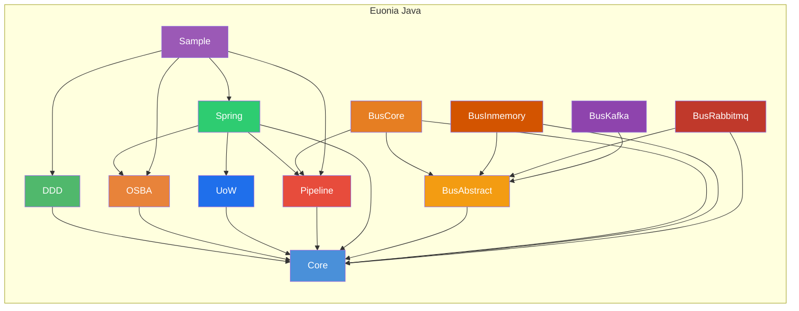
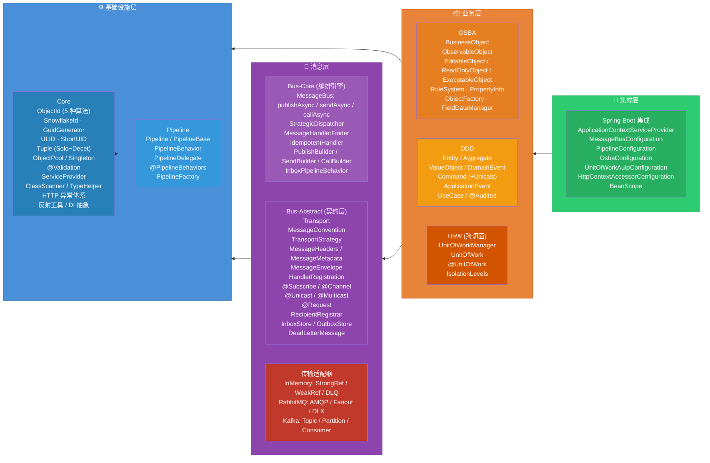

# Euonia Java 框架

> *Eunoia* —— 源自希腊语 *εὔνοια*：美好的思维、善意、心态平和。

Euonia 是一个用于构建企业级 Java 应用的开发框架。它将**面向对象可扩展业务架构（OSBA）**与**领域驱动设计（DDD）**理念结合起来，为构建健壮、可维护的业务系统提供完整基础设施。框架基于 **Java 17+**，可与 **Spring Boot 4.x / Spring Framework 7.x** 无缝集成。

- **语言**: Java 17+
- **构建工具**: Maven
- **许可证**: Apache License 2.0
- **仓库**: [euonia-project/euonia-java](https://github.com/euonia-project/euonia-java)
- **作者**: damon (zhaorong@outlook.com)

---

## 模块总览



## 模块列表

| 模块 | ArtifactId | 包数 | 类数 | 层次 | 说明 | 文档 |
|------|-----------|------|------|------|------|------|
| **core** | `euonia-core` | 7 | 74 | 基础层 | ID 生成、对象池、元组、注解校验、HTTP 异常、反射、DI 抽象 | [📖](./core/) |
| **osba** | `euonia-osba` | 6 | 45 | 业务层 | 面向对象业务架构：规则校验、属性追踪、状态机、反射工厂 | [📖](./osba/) |
| **ddd** | `euonia-domain-driven-design` | 6 | 24 | 业务层 | DDD 战术工具箱：Entity、Aggregate、Event、Command、UseCase | [📖](./ddd/) |
| **uow** | `euonia-unit-of-work` | 2 | 12 | 业务层 | 工作单元抽象：事务边界、提交/回滚、ThreadLocal 作用域 | [📖](./uow/) |
| **pipeline** | `euonia-pipeline` | 1 | 8 | 基础设施 | ASP.NET Core 风格中间件管道框架 | [📖](./pipeline/) |
| **bus-abstract** | `euonia-bus-abstract` | 12 | 57 | 消息层 | 消息总线抽象契约：传输、约定、策略、信封、注解、收件箱/发件箱 | [📖](./bus-abstract/) |
| **bus-core** | `euonia-bus-core` | 6 | 36 | 消息层 | 消息总线编排引擎：处理器发现、分发、流式构建器、幂等消费 | [📖](./bus-core/) |
| **bus-inmemory** | `euonia-bus-inmemory` | 2 | 18 | 消息层 | 进程内内存传输：双信使引擎（强引用/弱引用）、GC 友好 | [📖](./bus-inmemory/) |
| **bus-rabbitmq** | `euonia-bus-rabbitmq` | 1 | 9 | 消息层 | RabbitMQ AMQP 传输：fanout 多播、direct 队列、RPC 调用 | [📖](./bus-rabbitmq/) |
| **bus-kafka** | `euonia-bus-kafka` | 1 | 8 | 消息层 | Apache Kafka 传输：topic 发布、分区消费、RPC 请求-响应 | [📖](./bus-kafka/) |
| **spring** | `euonia-spring` | 7 | 9 | 集成层 | Spring Boot 自动配置 ×7、AOP 切面、ApplicationContext DI 桥接 | [📖](./spring/) |
| **sample** | `euonia-sample` | — | — | 示例 | Spring Boot 4.1 + CQRS + 消息总线 + RabbitMQ 完整示例 | — |

---

## 分层架构



## 模块依赖树

```wiki
sample ─── 完整示例应用，展示所有模块协同工作
 ├── ddd ────── Domain-Driven Design 战术工具箱
 │    ├── core ──── 零外部依赖的基础核心库
 │    ├── uow ───── 工作单元管理（事务边界）
 │    │    └── core
 │    ├── pipeline ─ 中间件管道框架
 │    │    └── core
 │    └── bus-core ─ 消息总线编排引擎
 │         └── bus-abstract ─ 消息总线抽象契约
 │              └── core
 ├── osba ───── 面向对象业务架构（规则+属性+工厂）
 │    └── core
 ├── pipeline ── 中间件管道
 │    └── core
 └── spring ──── Spring Boot 集成（自动配置 + AOP）
      ├── core
      ├── uow
      ├── osba
      ├── pipeline
      └── bus-core

bus-inmemory ──── 进程内内存传输（强/弱引用双引擎）
 ├── bus-abstract
 └── core

bus-rabbitmq ──── RabbitMQ AMQP 传输
 ├── bus-abstract
 └── core

bus-kafka ─────── Apache Kafka 传输
 ├── bus-abstract
 └── core
```

---

## 各模块详解

### core — 基础核心

Euonia 的基石，零外部运行时依赖。提供六类基础能力：

**ID 生成 — 统一门面 `ObjectId`：**

```java
// 五种策略，一种门面
var id1 = ObjectId.snowflake();                 // Snowflake 64-bit → long
var id2 = ObjectId.guid();                      // UUID (标准)
var id3 = ObjectId.guid(GuidType.SEQUENTIAL_AS_STRING); // .NET 兼容顺序 GUID
var id4 = ObjectId.random();                    // 随机字符串
var id5 = ObjectId.ulid();                      // 字典序可排序 ULID

// 类型安全取值
Long val = id1.getValue(Long.class);            // Long↔Integer 自动拆箱
```

**对象池 — `ObjectPool<T>` + `ObjectPoolPolicy<T>`：**

```java
var pool = DefaultObjectPoolProvider.getInstance().create(policy, 10);
var obj = pool.acquire();
// ... 使用 ...
pool.release(obj);
// 超限行为: THROW_EXCEPTION / RETURN_NULL / CREATE_NEW / WAIT_FOR_AVAILABLE
```

**元组 — Solo ~ Decet（1~10 元素 Record）：**

```java
var pair = Duet.of("key", 42);                  // Duet<String, Integer>
var t3   = Trio.of("a", 1, true);               // Trio<String, Integer, Boolean>
```

**注解校验 — `@Validation` 元注解框架：**

```java
@Required(message = "名称不能为空")
private String name;

@StringLength(min = 6, max = 20)
private String password;

@Range(min = 0, max = 150, inclusiveMax = true)
private int age;

@RegularExpression(value = "^[\\w.-]+@[\\w.-]+\\.[a-z]{2,}$")
private String email;
```

**HTTP 异常体系 — 12 种状态异常 + 请求上下文传播：**

```
HttpStatusException → BadRequest(400) / Forbidden(403) / NotFound(404)
                    / Conflict(409) / TooManyRequests(429)
                    / InternalServerError(500) / BadGateway(502) ...
RequestContextAccessor → ThreadLocal 请求上下文 + 跨线程传播
```

**反射 & DI 抽象 — `ServiceProvider` 契约：**

```java
public interface ServiceProvider {
    <T> Optional<T> getService(Class<T> type);
    <T> T getRequiredService(Class<T> type);
    <T> T createInstance(Class<T> type, Object... args);
}
// 内置: SimpleServiceProvider (Map注册) / DelegateServiceProvider (委托)
// Spring: ApplicationContextServiceProvider (ApplicationContext 桥接)
```

---

### osba — 面向对象业务架构

提供富业务对象层次结构，结合反射驱动的属性系统和可插拔规则引擎：

```text
BusinessObject<B>         ─── 核心：规则、上下文、字段管理
 ├── ObservableObject<T>  ─── 编辑状态追踪: NONE→NEW→CHANGED→DELETED
 │    ├── EditableObject<T> ── 异步规则校验 + save/delete 生命周期
 │    ├── ReadOnlyObject<T>  ── 不可变对象，绕过写检查
 │    └── ExecutableObject<T>── 操作型对象：execute() + create()
 └── 规则系统
      ├── Rule (接口) ── 异步规则契约
      ├── RuleBase ──── 自定义规则基类
      ├── LambdaRule ── Lambda 表达式规则
      ├── DataAnnotationRule ─ @Required/@Range 注解驱动
      ├── BrokenRule ── 违规记录 (ERROR/WARNING/INFO)
      └── RuleManager ─ 类型级单例注册表
```

**工厂模式 — 注解驱动的 CRUD 工厂：**

| 注解 | 生命周期方法 | 说明 |
|------|-------------|------|
| `@FactoryCreate` | `create(...)` | 创建新对象实例，生成 ID，发布事件 |
| `@FactoryFetch` | `fetch(...)` | 按 ID 从持久层加载（`loadProperty` 避免假变更） |
| `@FactoryInsert` | `insert(...)` | 持久化新对象 |
| `@FactoryUpdate` | `update(...)` | 持久化变更（`setProperty` 追踪变更） |
| `@FactoryDelete` | `delete(...)` | 标记删除 |
| `@FactoryExecute` | `execute(...)` | 执行自定义操作 |

**属性系统：**

```java
// 声明属性（自动注册到 FieldDataManager）
@DisplayName("用户姓名")
@Required(message = "姓名不能为空")
private final PropertyInfo<String> name = registerProperty(String.class, "name");

// 类型安全的属性访问
public String getName() { return getProperty(this.name); }
public void setName(String value) { setProperty(this.name, value); }  // 追踪变更

// 标记为"已加载"（从持久层恢复时使用，不视为变更）
public void loadName(String value) { loadProperty(this.name, value); }
```

---

### ddd — 领域驱动设计

DDD 战术模式构建块，与消息总线和 OSBA 深度集成：

```java
// 聚合根 — 内置领域事件管理
public class Order extends AggregateBase<Long> {
    public Order(Long id) {
        setId(id);
        // 注册事件处理器
        registerEvent(OrderCreatedEvent.class, e -> this.status = OrderStatus.CREATED);
    }

    public void create(Customer customer, Money total) {
        this.total = total;
        // 触发事件（自动存储到事件列表）
        raiseEvent(new OrderCreatedEvent(getId(), total));
    }
}

// 命令 — 通过消息总线的 Unicast 分发
public class CreateOrderCommand extends CommandBase {
    // HashMap-based 属性存储
}

// 用例 — 响应式结果通知
var presenter = new UseCasePresenter<OrderResult>();
presenter.subscribe(
    result -> log.info("成功: {}", result),
    error  -> log.error("失败", error)
);
```

**事件层次：**

```text
Event ── 基类 (sequence, eventIntent, originatorType, originatorId)
 ├── DomainEvent ──── 领域事件 (attach 到聚合根, EventAggregate 元数据)
 └── ApplicationEvent ─ 应用/集成事件
```

**值对象 — 属性等价而非标识等价：**

```java
public class Money extends ValueObject<Money> {
    private final BigDecimal amount;
    private final String currency;
    // equals/hashCode/compareTo 自动基于所有字段
}
```

---

### uow — 工作单元

事务资源协调器，支持编程式和声明式（AOP）两种使用方式：

```java
// 编程式
try (var uow = manager.begin(new UnitOfWorkOptions(true), false)) {
    uow.addContext("db", jdbcContext);
    uow.addContext("mq", kafkaContext);

    uow.addCompletedListener(e -> log.info("UoW {} 完成", e.getUnitOfWork().getId()));
    uow.addFailedListener(e -> log.error("UoW 失败", e.getException()));

    // ... 业务逻辑 ...

    await uow.completeAsync();  // saveChanges → commit → fire completed
}

// 声明式 (Spring AOP)
@Service
public class OrderService {
    @UnitOfWork(isTransactional = true, isolationLevel = READ_COMMITTED)
    public Order createOrder(CreateOrderCommand cmd) { ... }
}
```

**关键特性：**
- `UnitOfWorkManager` 通过 `ThreadLocal` 管理环境作用域
- `ChildUnitOfWork` — 嵌套时不开启新事务，委托给父级
- `requiresNew=true` — 强制创建独立事务
- 8 级隔离级别：`READ_UNCOMMITTED` → `SNAPSHOT` → `SERIALIZABLE`
- 生命周期钩子：`completed` / `failed` / `disposed` 监听器

---

### pipeline — 管道框架

受 ASP.NET Core 中间件模式启发，支持洋葱式请求处理：

```
Request → [Behavior 1] → [Behavior 2] → [Terminal] → Response
              ↑              ↑               ↑
          可以短路      可以转换响应       最终处理器
```

```java
// 即发即忘
Pipeline<Object, Void> pipe = new DefaultPipelineProvider<>(resolver)
    .use(LoggingBehavior.class)
    .use((ctx, next) -> next.invoke(ctx).thenRun(() -> log.info("Done")));
pipe.runAsync("Hello").join();

// 类型化请求/响应
Pipeline<Integer, Integer> pipe = new DefaultPipelineProvider<>(resolver);
pipe.use(PlusOneBehavior.class);
int result = pipe.runAsync(2, x -> CompletableFuture.completedFuture(x * 2)).join();
// result == 5 (2*2 + 1)
```

**关键特性：**
- `Pipeline<TRequest, TResponse>` 统一覆盖即发即忘和类型化场景
- 支持 Lambda 行为、类行为、`@PipelineBehaviors` 自动发现
- `ServiceProvider` 抽象：独立 `SimpleServiceProvider` 或 Spring `ApplicationContextServiceProvider`
- 全链路异步：所有组件返回 `CompletionStage`
- `build()` 反向链构建：最内层先执行

---

### bus — 消息总线系统

统一的消息总线，支持三种投递模式 + 三种传输适配器：

| 操作 | 方法 | 消息类型 | 传输策略 | 返回值 |
|------|------|----------|----------|--------|
| **发布** | `publishAsync` | `Multicast` | 多个传输并行 | `CompletableFuture<Void>` |
| **发送** | `sendAsync` | `Unicast` | 单个传输 | `CompletableFuture<Void>` |
| **调用** | `callAsync` | `Request<R>` | 单个传输，等待响应 | `CompletableFuture<R>` |

**消息处理流程：**

```text
MessageBus.sendAsync(msg)
    │
    ├── 1. MessageConvention.isUnicast(channel)    ← 类型校验
    ├── 2. RequestContextAccessor.getContext()     ← 上下文解析
    ├── 3. MessageCache.resolve(msgType)           ← 通道解析
    ├── 4. RoutedMessage<T> (envelope)             ← 信封构建
    ├── 5. PipelineFactory → PipelineMiddleware    ← 管道行为
    ├── 6. StrategicDispatcher.determine(msgType)  ← 分发决策
    └── 7. Transport.sendAsync(routedMsg)          ← 传输投递
```

**处理器发现 — 两种路径：**

```java
// 路径A: @Subscribe 注解
public class OrderHandler {
    @Subscribe(channel = "orders", group = "processor")
    public void handle(CreateOrderCommand cmd, MessageContext ctx) { ... }
}

// 路径B: Handler<M,R> 接口
public class OrderHandler implements Handler<CreateOrderCommand, Void> {
    @Override
    public Void handle(CreateOrderCommand cmd, MessageContext ctx) { ... }
}
```

**约定分类（消息怎么投）+ 策略路由（走哪条通道）：**

| 约定方式 | 实现 | 说明 |
|---------|------|------|
| 接口标记 | `implements Unicast / Multicast / Request<R>` | 编译时安全 |
| 注解标记 | `@Unicast / @Multicast / @Request` | 运行时灵活 |

| 策略方式 | 注解 | 说明 |
|---------|------|------|
| 分发目标 | `@DispatchIn(transports = {"rabbitmq"})` | 指定出站传输 |
| 接收来源 | `@ReceiveIn(transports = {"kafka"})` | 指定入站传输 |
| 本地消息 | `@LocalMessage` | 仅本地传输 |
| 分布式消息 | `@DistributedMessage` | 仅分布式传输 |

**三种传输对比：**

| 特性 | InMemory | RabbitMQ | Kafka |
|------|----------|----------|-------|
| 消息持久化 | ❌ | ✅ | ✅ |
| 多播语义 | WeakRef Messaging | Fanout Exchange | Topic Publish |
| 单播语义 | StrongRef Messaging | Direct Queue | Partition Queue |
| RPC | CompletableFuture | replyTo/correlationId | Reply Topic |
| 重试策略 | ❌ | Failsafe | Failsafe |
| 死信处理 | InMemoryDeadLetterQueue | Dead Letter Exchange | ❌ |
| GC 友好 | ✅ WeakReference 自动退订 | ❌ | ❌ |
| 适用场景 | 开发/测试/低延迟 | 企业集成 | 事件流/大数据 |

**幂等消费：**

```java
// IdempotentHandler 装饰器 — 基于 InboxStore 防重复
// InboxPipelineBehavior — 处理后自动更新收件箱状态
handlerContext.register(messageType, IdempotentHandler.wrap(handler, inboxStore));
```

---

### spring — Spring 集成

7 个 `@Configuration` 类 + 1 个 `@Aspect` 切面：

| 配置类 | 注册的 Bean | 作用域 |
|--------|-----------|--------|
| `ServiceProviderConfiguration` | `ApplicationContextServiceProvider` | singleton |
| `MessageBusConfiguration` | `Bus`, `HandlerContext` | singleton |
| `PipelineConfiguration` | `PipelineFactory`, `Pipeline`, `PipelineDelegate` | singleton / prototype |
| `OsbaConfiguration` | `ObjectFactory`, `BusinessObjectFactory` | singleton |
| `HttpContextAccessorConfiguration` | `RequestContextAccessor` | singleton |
| `UnitOfWorkAutoConfiguration` | `UnitOfWorkManager`, `@EnableAspectJAutoProxy` | singleton |
| `UnitOfWorkAspect` | `@Around("@annotation(UnitOfWork)")` | aspect |

```java
// 零配置使用
@SpringBootApplication
public class Application {
    public static void main(String[] args) {
        SpringApplication.run(Application.class, args);
    }
    // 所有 Euonia 组件自动配置完成
}
```

---

## 设计模式速览

| 模式 | 应用模块 | 具体位置 |
|------|---------|---------|
| **门面 (Facade)** | core | `ObjectId` 统一 5 种 ID 生成策略 |
| **工厂方法** | core, osba | Tuple 的 `of()`/`from()`、`ObjectFactory` 注解驱动工厂 |
| **抽象工厂** | pipeline | `PipelineFactory` / `DefaultPipelineFactory` |
| **构建器** | bus-core, bus-abstract | `SendBuilder`/`PublishBuilder`/`CallBuilder`、`MessageConventionBuilder` |
| **策略** | core, bus | `ObjectPoolPolicy`、`MessageConvention`、`TransportStrategy` |
| **模板方法** | osba, ddd, core | `addRules()`/`initialize()`、`DomainEventBase.attach()`、`AccountException` |
| **观察者** | osba, ddd, bus | `PropertyChangeSupport`、`SubmissionPublisher`、`MessageContextBase` |
| **装饰器** | core, bus-core | `RequestContextCopyingDecorator`、`IdempotentHandler`、`Overridable*Convention` |
| **单例** | core, osba | `Singleton<T>`、`DefaultObjectPoolProvider`、`RuleManager`（按类型） |
| **对象池** | core | `DefaultObjectPool<T>` + `ObjectPoolPolicy<T>` + `OversizeBehavior` |
| **元注解** | core | `@Validation(validator = ...)` 绑定注解到校验器 |
| **类型令牌** | core | `GenericType<T>` + `SyntheticParameterizedType` |
| **委托** | core, pipeline | `DelegateServiceProvider`、`DelegateRequestContextAccessor`、`PipelineDelegate` |
| **CQRS** | ddd, bus | `Command` (Unicast) + `Event` (Multicast) 通过消息总线分发 |
| **端口-适配器** | ddd | `UseCaseSuccess<O>` / `UseCaseFailure` 输出端口 |
| **事件溯源** | ddd | `HasDomainEvents` + `raiseEvent`/`applyEvent`/`clearEvents` |
| **实体-值对象** | ddd | `Entity<ID>` 标识等价 vs `ValueObject<T>` 属性等价 |
| **聚合模式** | ddd | `AggregateBase` 管理子实体一致性和领域事件 |
| **中间件/管道** | pipeline | `PipelineBehavior` 洋葱式请求处理 |

---

## 典型开发工作流

### 场景：创建一个"订单创建"业务功能

**第 1 步 — 定义领域模型 (ddd)**

```java
// 值对象
public class Money extends ValueObject<Money> { ... }
public class OrderLine extends ValueObject<OrderLine> { ... }

// 聚合根
public class Order extends AggregateBase<Long> {
    private Money total;
    private List<OrderLine> lines;

    public Order(Long id) {
        setId(id);
        registerEvent(OrderCreatedEvent.class, e -> this.status = OrderStatus.CREATED);
    }
}
```

**第 2 步 — 定义命令 (ddd + bus)**

```java
@Unicast
@Channel("orders")
public class CreateOrderCommand extends CommandBase {
    // HashMap properties: customerId, lines, total
}
```

**第 3 步 — 实现命令处理器 (bus)**

```java
public class CreateOrderHandler implements Handler<CreateOrderCommand, Void> {
    @Override
    public Void handle(CreateOrderCommand cmd, MessageContext ctx) {
        var order = new Order(ObjectId.snowflake().getValue(Long.class));
        order.create(cmd.getCustomerId(), cmd.getLines(), cmd.getTotal());
        repository.save(order);
        // 发布领域事件
        order.getEvents().forEach(event -> bus.publishAsync(event));
        ctx.response(order.getId());
        return null;
    }
}
```

**第 4 步 — 通过消息总线发送 (bus-core)**

```java
// 流式 API
bus.send(new CreateOrderCommand(...))
    .toChannel("orders")
    .executeAsync()
    .join();

// 或异步订阅响应
bus.send(new CreateOrderCommand(...))
    .pipeTo(response -> log.info("订单ID: {}", response))
    .executeAsync();
```

**第 5 步 — 事务保护 (uow)**

```java
@UnitOfWork(isTransactional = true)
public void handle(CreateOrderCommand cmd, MessageContext ctx) {
    // 方法内的所有持久化操作在同一个事务中
}
```

---

## 快速开始

### 最小依赖

```xml
<!-- 核心工具（必选） -->
<dependency>
    <groupId>com.euonia</groupId>
    <artifactId>core</artifactId>
    <version>${revision}</version>
</dependency>
```

### 即发即忘管道

```java
var resolver = new SimpleServiceProvider();
Pipeline<Object, Void> pipeline = new DefaultPipelineProvider<>(resolver)
    .use((ctx, next) -> {
        System.out.println("Before: " + ctx);
        return next.invoke(ctx).thenRun(() -> System.out.println("After: " + ctx));
    });
pipeline.runAsync("Hello, Pipeline!").toCompletableFuture().join();
```

### 进程内消息总线

```java
// 配置
var configurator = new DefaultConfigurator();
configurator.setConvention(b -> b.add(new DefaultMessageConvention()));
configurator.registerHandlers(OrderHandler.class);

// 创建传输
var transport = new InMemoryTransport(handlerContext);
var provider = new SimpleServiceProvider();
provider.register(Transport.class, transport);

// 发送
var bus = new MessageBus(provider, dispatcher, options);
bus.send(new CreateOrderCommand(...)).executeAsync().join();
```

### Spring Boot 集成

```java
@SpringBootApplication  // 自动配置所有 Euonia 组件
public class Application {
    public static void main(String[] args) {
        SpringApplication.run(Application.class, args);
    }
}

@Service
public class OrderService {
    @Autowired private Bus bus;
    @Autowired private PipelineFactory pipelineFactory;

    public void createOrder(CreateOrderCommand cmd) {
        bus.send(cmd).executeAsync();
    }
}
```
