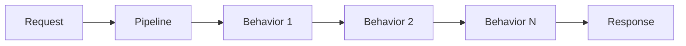

# Euonia Pipeline 模块 API 文档

## 概述

Pipeline 模块是 Euonia 框架的管道抽象层，提供构建和执行组件管道的契约与实现。该模块采用了经典的 Pipeline/Delegate/Behavior 模式，支持异步请求处理、反射驱动的行为解析以及基于注解的组件发现。

- **Maven 坐标**: `com.euonia:pipeline`
- **Java 模块名**: `com.euonia.pipeline`
- **依赖**: `com.euonia:core`

## 导出包

### com.euonia.pipeline

核心管道包，包含管道接口、抽象实现、委托模式、行为组件和工厂抽象。

| 类 | 类型 | 说明 |
|----|------|------|
| [Pipeline](./com.euonia.pipeline.Pipeline.md) | interface | 管道接口，定义构建和执行组件管道的契约 |
| [PipelineBase](./com.euonia.pipeline.PipelineBase.md) | abstract class | 管道抽象基类，提供组件管理和构建逻辑 |
| [PipelineDelegate](./com.euonia.pipeline.PipelineDelegate.md) | @FunctionalInterface | 管道委托，表示管道中处理请求的单个组件 |
| [PipelineBehavior](./com.euonia.pipeline.PipelineBehavior.md) | interface | 管道行为接口，定义组件的异步处理方法 |
| [@PipelineBehaviors](./com.euonia.pipeline.PipelineBehaviors.md) | annotation | 标记请求类型关联的管道行为组件 |
| [PipelineFactory](./com.euonia.pipeline.PipelineFactory.md) | interface | 管道工厂接口，抽象 Pipeline 实例的创建 |
| [DefaultPipelineFactory](./com.euonia.pipeline.DefaultPipelineFactory.md) | class | 管道工厂默认实现，基于 ServiceProvider |
| [DefaultPipelineProvider](./com.euonia.pipeline.DefaultPipelineProvider.md) | class | 管道提供者，使用反射调用管道行为 |

## 架构说明

### 管道模式

Pipeline 模块采用类似 ASP.NET Core 中间件的管道模式：

1. **Pipeline** — 定义管道契约，支持添加组件、构建和异步执行
2. **PipelineBehavior** — 每个行为组件处理请求并选择是否调用 `next.invoke()`
3. **PipelineDelegate** — 表示管道中"下一个"处理节点
4. **@PipelineBehaviors** — 将请求类型与行为组件关联

### 关键流程

1. 通过 `PipelineFactory.create()` 创建管道实例
2. 使用 `use()` 或 `useOf()` 添加行为组件
3. 调用 `build()` 构建委托链（组件反转后依次包裹）
4. 调用 `runAsync()` 异步执行整个管道

## 依赖

- `com.euonia:core` (compile)
- `org.junit.jupiter:junit-jupiter` (test)

## 作者

- damon (zhaorong@outlook.com)
